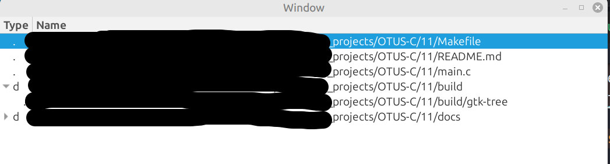

Задание

Написать приложение с использованием GTK, отображающее файлы и директории в текущем каталоге.
Сторонние библиотеки (кроме GLib/GTK) не использовать.

Сложность
★★★☆☆
Цель задания
Получить навык работы с библиотеками GLib и GTK.

Критерии успеха
1. Создано приложение, при запуске рекурсивно отображающее в GtkTreeView-виджете файлы и
директории, расположенные в директории, откуда оно было запущено.
2. Код компилируется без предупреждений с ключами компилятора -Wall -Wextra -Wpedantic -
std=c11. Предупреждения об устаревших API допускаются.
3. Далее успешность определяется ревью кода.

Обратная связь
Cтудент коммитит все необходимое в свой github/gitlab репозиторий. Далее необходимо зайти в ЛК, найти
занятие, ДЗ по которому выполнялось, нажать “Чат с преподавателем” и отправить ссылку. После этого
ревью и общение на тему ДЗ будет происходить в рамках этого чата.

Вспомогательные материалы
1. Getting Started with GTK (https://docs.gtk.org/gtk4/getting_started.html)
2. Gtk - 4.0: Tree and List Widget Overview (https://docs.gtk.org/gtk4/section-tree-widget.html)
3. File Utilities: GLib Reference Manual (https://web.archive.org/web/20240428071825/https://developer-old.gnome.org/glib/stable/glib-File-Utilities.html)


Решение:

```bash
sudo apt install libgtk-4-dev
make
```

